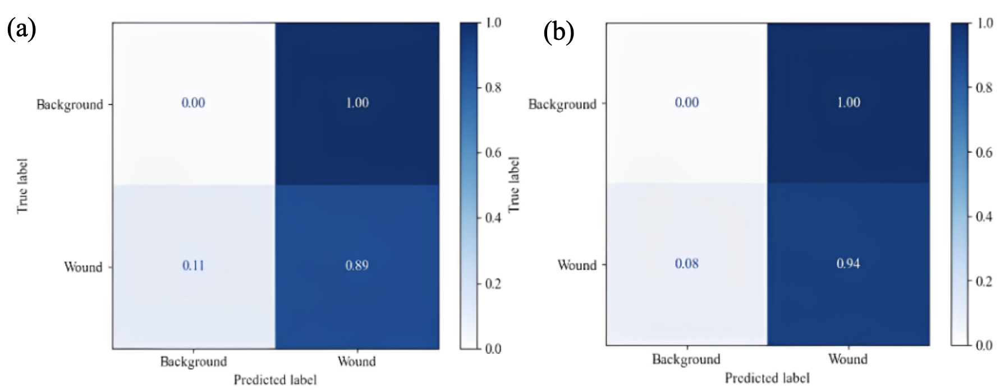
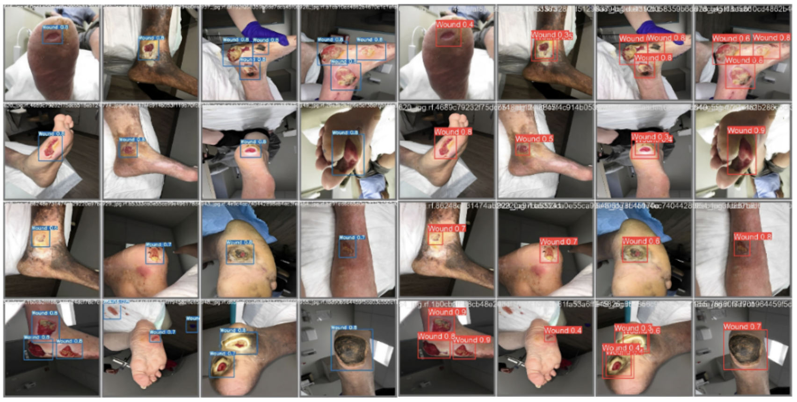

# Chronic Wound Monitoring Using YOLO Models

This project aims to detect and classify chronic wounds using YOLOv7 and YOLOv8, and compare the results

Dataset used: AZH dataset

The figures below show the confusion matrices of the prediction models developed using YOLOv7 and YOLOv8: 
(a) YOLOv7 - 89% accuracy (b) Yolov8 - 94% accuracy

Sample results of detected wounds using the YOLOv7 model and YOLOv8 model are displayed below:

Insights:
- Generally, both models were able to accurately detect wounds
- YOLOv7 model inaccurately detected blood marks and spots on the floor as wounds, as shown in the second picture from the last row
- Bounding boxes of detected wounds of YOLOv8 are smaller, and this supports YOLOv8 achieving a high mAP score

Part of the book series: Lecture Notes in Networks and Systems ((LNNS,volume 1169))
Included in the following conference series:
International Conference on Intelligent Computing & Optimization

Link: https://link.springer.com/chapter/10.1007/978-3-031-73324-6_21
